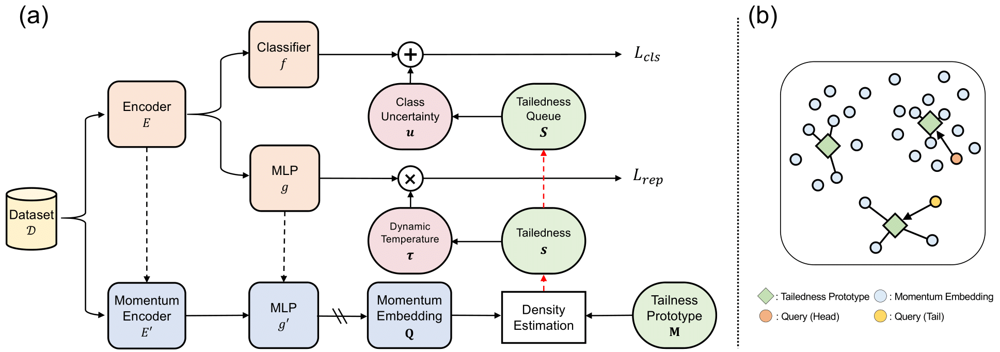

# Rethinking Open-World Semi-Supervised Learning: Distribution Mismatch and Inductive Inference.

**CVPR Workshop 2024:** This repository is the official implementation of [DTS](https://arxiv.org/abs/2405.20829).

## Introduction
Open-world semi-supervised learning (OWSSL) extends conventional semi-supervised learning to open-world scenarios by taking account of novel categories in unlabeled datasets. Despite the recent advancements in OWSSL, the success often relies on the assumptions that 1. labeled and unlabeled datasets share the same balanced class prior distribution, which does not generally hold in real-world applications, and 2. unlabeled training datasets are utilized for evaluation, where such transductive inference might not adequately address challenges in the wild. In this paper, we aim to generalize OWSSL by addressing them. Our work suggests that practical OWSSL may require different training settings, evaluation methods, and learning strategies compared to those prevalent in the existing literature.

## Method
<div align=center>

</div>

Overview of the Density-based Temperature scaling and Soft pseudo-labeling (DTS).

## Environment
Requirements:
```
loguru
numpy
pandas
scikit_learn
scipy
torch==1.10.0
torchvision==0.11.1
tqdm
```

## Data
We provide the specific train split of CIFAR-10 and CIFAR-100 with different imbalance ratios, please refer to ```data_uq_idxs``` for details. We also provide the source code in ```data/imagenet.py``` for splitting data to the proposed ROWSSL setting.


## Training
### CIFAR-10
```
bash scripts/run_cifar10_ours.sh
```

### CIFAR-100
```
bash scripts/run_cifar100_ours.sh
```

## Acknowledgments
The codebase is largely built on [GCD](https://github.com/CVMI-Lab/SimGCD), [SimGCD](https://github.com/CVMI-Lab/SimGCD) and [BaCon](https://github.com/JianhongBai/BaCon). Thanks for their great work!

## Citation
```
@article{park2024rethinking,
  title={Rethinking Open-World Semi-Supervised Learning: Distribution Mismatch and Inductive Inference},
  author={Park, Seongheon and Kwon, Hyuk and Sohn, Kwanghoon and Lee, Kibok},
  journal={arXiv preprint arXiv:2405.20829},
  year={2024}
}
```
